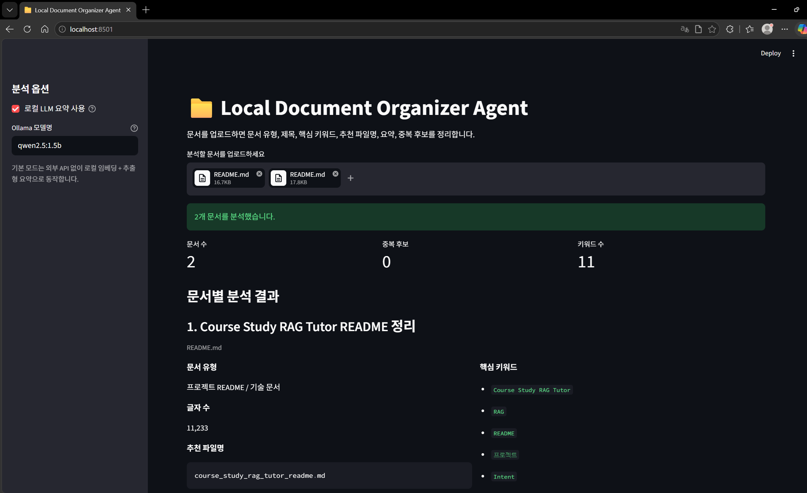
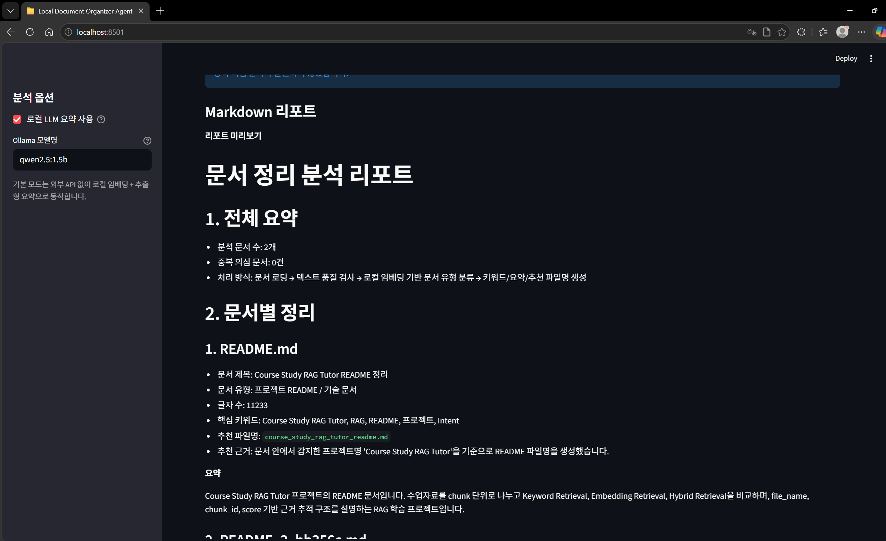
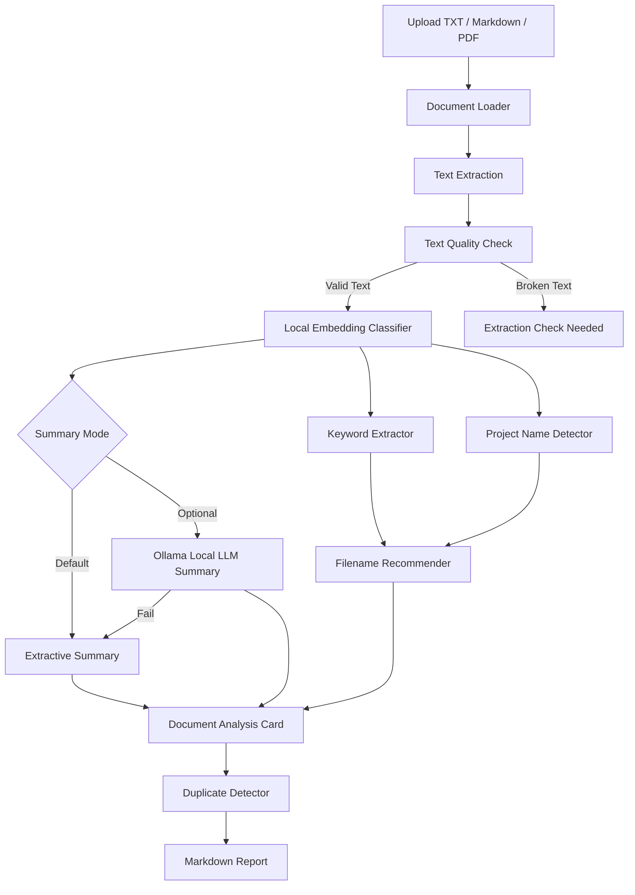

# Local Document Organizer Agent

로컬 문서를 업로드하면 문서 유형을 분류하고, 핵심 키워드, 추천 파일명, 요약, 중복 후보, Markdown 리포트를 생성하는 문서 정리 자동화 Agent입니다.

이 프로젝트는 단순히 파일명을 바꾸는 도구가 아니라, 문서에서 추출한 텍스트를 기반으로 **텍스트 품질 검사 → 로컬 임베딩 기반 문서 유형 분류 → 키워드 추출 → 요약 생성 → 중복 후보 탐지 → Markdown 리포트 생성**까지 이어지는 문서 처리 workflow를 구현한 프로젝트입니다.

기본 모드는 외부 API 없이 동작하며, 선택적으로 Ollama 기반 로컬 LLM 요약 모드를 사용할 수 있도록 구성했습니다.

---

## 1. Project Overview

Local Document Organizer Agent는 TXT, Markdown, PDF 문서를 업로드하면 다음 정보를 자동으로 정리합니다.

- 문서 유형
- 문서 제목
- 핵심 키워드
- 추천 파일명
- 요약
- 중복 의심 문서
- Markdown 리포트

초기 버전은 규칙 기반 문서 유형 판정과 단순 키워드 추출을 사용했습니다. 그러나 다양한 문서를 테스트하면서 다음 문제가 확인되었습니다.

- 같은 이름의 `README.md` 파일 2개를 구분하지 못함
- README 문서가 다른 문서 유형으로 오분류됨
- Mermaid 구조도 코드가 요약에 섞임
- PDF에서 글자 인코딩이 깨진 경우에도 무리하게 요약함
- 문서 유형이 다양해질수록 profile을 계속 추가해야 함
- 요약 품질이 단순 문장 추출에 의존함

이를 개선하기 위해 다음 구조로 재설계했습니다.

- 같은 이름 파일 구분을 위한 `document_id` 및 unique display name 생성
- PDF/TXT/Markdown 텍스트 품질 검사
- 로컬 SentenceTransformer 임베딩 기반 문서 유형 분류
- 넓은 범주의 문서 유형 분류 체계 적용
- README 내 프로젝트명 감지 및 프로젝트별 파일명 추천
- Markdown/Mermaid/code block 정리
- 기본 추출형 요약 + 선택적 Ollama 로컬 LLM 요약 모드
- Streamlit UI 및 Markdown 리포트 생성

---

## 2. Demo Screenshots

### Streamlit Main Result

문서를 업로드하면 문서 수, 중복 후보 수, 키워드 수가 표시되고, 각 문서별 분석 결과가 카드 형태로 출력됩니다.  
같은 이름의 `README.md` 파일을 여러 개 업로드해도 내부 표시명을 다르게 생성해 각각 분석합니다.



---

### Markdown Report Result

분석 결과는 Markdown 리포트로 자동 정리되며, Streamlit 화면에서 미리보기와 다운로드가 가능합니다.  
로컬 LLM 요약 옵션을 사용한 경우에도 동일한 리포트 구조로 결과가 정리됩니다.



---

## 3. Key Features

| Feature | Description |
|---|---|
| Multi-file Upload | TXT, Markdown, PDF 문서 여러 개 업로드 |
| Same Filename Handling | 같은 이름의 파일도 unique display name으로 구분 |
| Text Quality Check | 깨진 PDF/TXT는 자동 분석하지 않고 확인 필요 문서로 분리 |
| Local Embedding Classification | SentenceTransformer 기반 로컬 문서 유형 분류 |
| Broad Document Categories | README, 기획서, 포트폴리오, 학습자료, 시나리오, 시간표, TODO 등 넓은 유형 분류 |
| Keyword Extraction | domain phrase + token 기반 핵심 키워드 추출 |
| Project Name Detection | README 내부 프로젝트명을 감지해 제목/파일명/키워드 보정 |
| Filename Recommendation | 문서 유형 또는 프로젝트명 기반 추천 파일명 생성 |
| Summary Generation | 기본 추출형 요약과 선택적 로컬 LLM 요약 지원 |
| Duplicate Detection | 문서 간 유사도를 계산해 중복 후보 표시 |
| Markdown Report | 분석 결과를 Markdown 리포트로 생성 및 다운로드 |

---

## 4. Workflow

```text
Uploaded Documents
        ↓
Document Loader
        ↓
Text Extraction
        ↓
Text Quality Check
        ↓
Local Embedding-based Document Classification
        ↓
Keyword Extraction
        ↓
Project Name Detection
        ↓
Summary Generation
   ├─ Basic Extractive Summary
   └─ Optional Local LLM Summary via Ollama
        ↓
Filename Recommendation
        ↓
Duplicate Candidate Detection
        ↓
Markdown Report Generation
```

---

## 5. Architecture



---

## 6. Document Type Categories

문서 유형은 너무 세부적인 profile을 계속 추가하는 방식이 아니라, 넓은 범주 기반으로 분류합니다.

| Document Type | Description |
|---|---|
| 프로젝트 README / 기술 문서 | GitHub README, 실행 방법, 기술 스택, 구조 설명 문서 |
| 기획서 / 제안서 | 문제 정의, 접근 방식, 모델 구조, 기대효과, 평가 방법을 담은 문서 |
| 포트폴리오 / 자기소개서 | 취업 포트폴리오, 자기소개서, 프로젝트 경험 정리 문서 |
| 학습 자료 | 수업자료, 개념 설명, 용어 정리, 학습 노트 |
| 시나리오 / 대화 스크립트 | 서비스 시나리오, 사용자 발화, 선택지, AI 응답 흐름 |
| 일정 / 시간표 자료 | 수강신청, 시간표, 일정 문서 |
| 구현 TODO / 작업 목록 | 미구현 기능, 보완 사항, 개발 체크리스트 |
| 일반 문서 | 특정 유형으로 분류하기 어려운 일반 텍스트 문서 |
| 텍스트 추출 확인 필요 | PDF 인코딩 깨짐, 이미지 기반 PDF 등 자동 분석이 어려운 문서 |

---

## 7. Project Name Detection

README 문서는 모두 같은 `프로젝트 README / 기술 문서` 유형으로 분류되지만, 실제 프로젝트명은 문서 내부 내용을 기반으로 별도 감지합니다.

지원 예시:

- Multimodal Intent QA Agent
- Course Study RAG Tutor
- Local Document Organizer Agent
- Manufacturing MCP Agent
- Sensor Anomaly Model Pipeline
- AI 의결서 RAG
- Fair Decision RAG
- Biz-English

예를 들어 같은 이름의 `README.md` 2개를 업로드해도 다음처럼 구분됩니다.

```text
README.md
→ Course Study RAG Tutor README 정리
→ course_study_rag_tutor_readme.md

README_2_xxxxxx.md
→ Multimodal Intent QA Agent README 정리
→ multimodal_intent_qa_agent_readme.md
```

---

## 8. Text Quality Check

일부 PDF는 텍스트가 추출되더라도 실제 내용이 깨져 나올 수 있습니다.

예:

```text
RAG lp| ¬©‹Ÿfl? AI X°˝ R RAG Project ...
```

이런 경우에는 무리하게 요약하지 않고 다음과 같이 처리합니다.

```text
문서 유형: 텍스트 추출 확인 필요
문서 제목: 텍스트 추출 실패 문서
핵심 키워드: 추출 불가
추천 파일명: extraction_check_needed.pdf
요약: 문서에서 읽을 수 있는 텍스트가 충분히 추출되지 않아 자동 요약을 생성하지 않았습니다.
```

이 기능은 잘못된 요약을 생성하지 않기 위한 안전 장치입니다.

---

## 9. Summary Modes

### Default Mode

기본 모드는 외부 API 없이 동작합니다.

```text
Local Embedding Classification
+ Keyword Extraction
+ Heading-aware / Type-aware Extractive Summary
```

기본 모드의 장점:

- 외부 API 불필요
- 실행 환경이 단순함
- 포트폴리오 시연에 안정적
- LLM이 없어도 기본 기능 동작

### Optional Local LLM Mode

Ollama가 설치된 환경에서는 선택적으로 로컬 LLM 요약을 사용할 수 있습니다.

```text
Ollama Local LLM
qwen2.5:1.5b / llama3.2:1b / gemma2:2b
```

LLM 호출이 실패하면 기본 추출형 요약으로 자동 대체됩니다.

---

## 10. Tech Stack

| Category | Stack |
|---|---|
| Language | Python |
| UI | Streamlit |
| PDF Parsing | PyMuPDF |
| Embedding Model | sentence-transformers/paraphrase-multilingual-MiniLM-L12-v2 |
| Classification | Local embedding similarity + rule boost |
| Keyword Extraction | Domain phrase + token frequency |
| Optional LLM | Ollama local model |
| Report | Markdown |
| Duplicate Detection | Text similarity-based duplicate candidate detection |

---

## 11. Project Structure

```text
local-document-organizer-agent/
├─ app.py
├─ main.py
├─ requirements.txt
├─ README.md
├─ docs/
│  └─ images/
│     ├─ streamlit_main_result.png
│     └─ document_analysis_result.png
├─ sample_docs/
├─ reports/
└─ src/
   ├─ document_loader.py
   ├─ document_analyzer.py
   ├─ profile_classifier.py
   ├─ project_utils.py
   ├─ keyword_extractor.py
   ├─ summarizer.py
   ├─ llm_summarizer.py
   ├─ text_quality.py
   ├─ duplicate_detector.py
   ├─ file_renamer.py
   ├─ report_generator.py
   └─ __init__.py
```

---

## 12. Core Modules

| File | Role |
|---|---|
| `app.py` | Streamlit UI, upload flow, result cards, Markdown report |
| `document_loader.py` | TXT/Markdown/PDF loading, same filename handling, document_id generation |
| `text_quality.py` | broken text / extraction quality detection |
| `profile_classifier.py` | local embedding-based document type classification |
| `project_utils.py` | project name detection and README filename generation |
| `keyword_extractor.py` | Markdown cleanup, tokenization, domain phrase keyword extraction |
| `summarizer.py` | default type-aware extractive summary |
| `llm_summarizer.py` | optional Ollama local LLM summary |
| `document_analyzer.py` | analysis pipeline orchestration |
| `duplicate_detector.py` | duplicate candidate detection |
| `report_generator.py` | legacy Markdown report generator |

---

## 13. Installation

```bash
pip install -r requirements.txt
```

`requirements.txt`

```txt
streamlit
PyMuPDF
sentence-transformers
numpy
```

---

## 14. How to Run

```bash
streamlit run app.py --server.fileWatcherType none
```

`--server.fileWatcherType none` 옵션은 Streamlit이 `sentence-transformers` 관련 내부 모듈을 감시하면서 발생할 수 있는 불필요한 watcher 경고를 줄이기 위해 사용합니다.

---

## 15. Optional Local LLM Setup

Ollama가 설치된 환경에서는 로컬 LLM 요약 모드를 사용할 수 있습니다.

```bash
ollama pull qwen2.5:1.5b
```

앱 실행 후 Streamlit 사이드바에서 다음 옵션을 체크합니다.

```text
로컬 LLM 요약 사용
```

Ollama가 없거나 모델 호출에 실패해도 앱은 중단되지 않으며, 기본 추출형 요약으로 자동 대체됩니다.

---

## 16. Verified Results

### Same Filename Upload

같은 이름의 파일을 업로드해도 각각 다른 문서로 인식합니다.

```text
README.md
README_2_541137.md
```

### Example Result 1

```text
문서 제목:
Course Study RAG Tutor README 정리

문서 유형:
프로젝트 README / 기술 문서

추천 파일명:
course_study_rag_tutor_readme.md

핵심 키워드:
Course Study RAG Tutor, RAG, README, 프로젝트, Intent
```

### Example Result 2

```text
문서 제목:
Multimodal Intent QA Agent README 정리

문서 유형:
프로젝트 README / 기술 문서

추천 파일명:
multimodal_intent_qa_agent_readme.md

핵심 키워드:
Multimodal Intent QA Agent, RAG, AI Agent, Agent Workflow
```

### Broken PDF Handling

깨진 텍스트가 감지되면 다음과 같이 처리합니다.

```text
문서 유형:
텍스트 추출 확인 필요

핵심 키워드:
추출 불가

추천 파일명:
extraction_check_needed.pdf
```

---

## 17. Development Notes

이 프로젝트는 단순 파일 정리 도구에서 시작해, 문서 처리 Agent 구조로 확장되었습니다.

개선 과정에서 해결한 문제는 다음과 같습니다.

| Problem | Improvement |
|---|---|
| 같은 이름 파일이 덮어써지는 문제 | unique display name, document_id 생성 |
| README 문서가 다른 유형으로 오분류됨 | 로컬 임베딩 기반 넓은 카테고리 분류 |
| 프로젝트별 README 구분이 어려움 | project name detector 추가 |
| Mermaid 구조도 코드가 요약에 섞임 | Markdown/code block cleanup 강화 |
| 깨진 PDF를 무리하게 요약함 | text quality check 추가 |
| 요약 품질이 낮음 | type-aware summary + optional local LLM mode |
| report_generator signature 문제 | app.py 내부 Markdown report 생성으로 안정화 |

---

## 18. My Role

- 로컬 문서 로딩 구조 구현
- TXT/Markdown/PDF 문서 파싱
- 같은 파일명 업로드 처리 개선
- 텍스트 품질 검사 로직 추가
- 로컬 임베딩 기반 문서 유형 분류 구조 설계
- 프로젝트명 감지 기반 README 분석 개선
- 핵심 키워드 추출 로직 개선
- 기본 추출형 요약 및 선택적 로컬 LLM 요약 구조 설계
- 중복 후보 탐지 결과 UI 표시
- Streamlit UI 구성
- Markdown 리포트 생성 흐름 구현
- 오류 사례 기반 개선 반복

---

## 19. What I Learned

이 프로젝트를 통해 문서 자동화 Agent에서 중요한 것은 단순히 LLM을 붙이는 것이 아니라, 입력 문서의 품질을 먼저 확인하고, 문서 유형과 목적에 맞게 처리 흐름을 분리하는 것임을 확인했습니다.

특히 PDF나 Markdown 문서에서는 텍스트 추출 결과가 항상 정상적이지 않기 때문에, 요약이나 분류 전에 텍스트 품질 검사 단계가 필요했습니다. 또한 문서 유형을 세부 profile로 계속 추가하는 방식보다, 로컬 임베딩을 활용해 넓은 범주로 분류하고 필요한 경우 프로젝트명을 별도로 감지하는 방식이 더 안정적이라는 점을 확인했습니다.

---

## 20. Limitations & Future Improvements

- PDF OCR 지원 추가
- 이미지 기반 PDF 처리
- 중복 탐지 기준 세분화
- 문서 유형별 confidence score UI 표시
- Local LLM 요약 결과와 기본 요약 비교 표시
- 폴더 단위 일괄 분석 기능 강화
- 추천 파일명 실제 rename 기능 추가
- 분석 결과 JSON export 추가
- 테스트 코드 추가
- Docker 실행 환경 구성

---

## 21. Interview Summary

Local Document Organizer Agent는 로컬 문서를 업로드하면 문서 유형 분류, 핵심 키워드 추출, 추천 파일명 생성, 요약, 중복 후보 탐지, Markdown 리포트 생성을 수행하는 문서 자동화 Agent입니다.

초기에는 규칙 기반 문서 유형 판정과 빈도 기반 키워드 추출을 사용했지만, 다양한 문서에서 오분류와 낮은 요약 품질이 발생했습니다. 이를 개선하기 위해 텍스트 품질 검사, 로컬 SentenceTransformer 임베딩 기반 문서 유형 분류, 프로젝트명 감지, 같은 이름 파일 구분, 선택적 Ollama 로컬 LLM 요약 모드를 추가했습니다.

이 프로젝트는 LLM을 무조건 사용하는 방식이 아니라, 기본 기능은 외부 API 없이 안정적으로 동작하게 하고, 필요할 때만 로컬 LLM을 선택적으로 사용하도록 설계한 문서 처리 Agent입니다.
